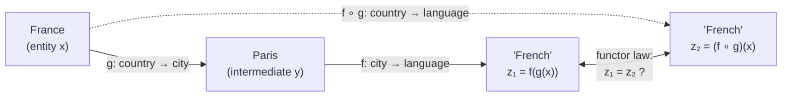
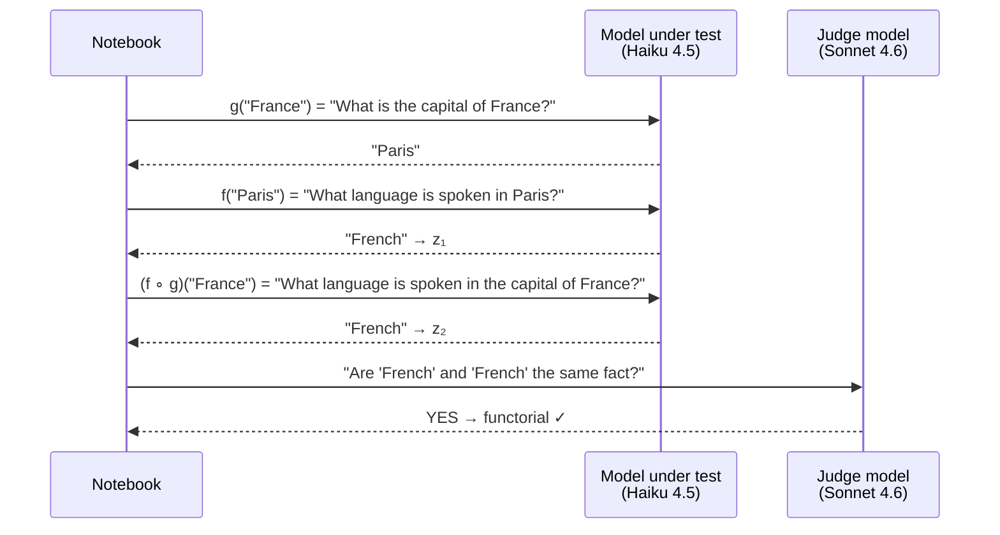

# Intro: a problem, a toolkit, and a fresh angle

*If you've never thought about category theory before, start here. If you have, the [README](./README.md) is shorter and gets to the technical pitch faster.*

---

## 1. The problem: when LLMs compose facts, they break in a specific way

You're shipping an LLM-powered feature. Maybe it's a multi-step research agent. Maybe it's a RAG system that retrieves several documents and synthesizes an answer. Maybe it's a SQL-generating tool that has to reason about joins. Whatever it is, it doesn't just answer a single question — it composes facts.

And when it composes facts, it confabulates. Not always. But often enough that "correctness" has stopped meaning "right vs wrong" and started meaning "right *enough* of the time, for the cases I tested." That's not a satisfying place to ship from.

Here's the specific failure mode this repo cares about. Suppose you ask the model two questions:

```
Q1: "What is the capital of France?"          → "Paris"
Q2: "What language is primarily spoken in Paris?" → "French"
```

Both answers are right. Now ask the same model the *composed* question:

```
Q3: "What language is primarily spoken in the capital of France?"
```

The right answer is still "French" — it has to be, because Q3 is just Q1 and Q2 stuck together. But sometimes the model gives a different answer. Maybe it says "they speak many languages there" or "English" or hedges in some way. Or — more often — it gives the right answer to Q3 but a *wrong* answer to Q1, and you'd never notice unless you happened to ask both.

This is the failure mode worth naming. The model produced two outputs that don't fit together, even though the relationship between them is mechanical. That's not "hallucination" in the loose sense. That's the model contradicting itself across two phrasings of the same underlying fact, and it's a much more measurable thing than "is the answer true."

Most production LLM bugs you'll hit in 2026 will look like this. Multi-hop reasoning chains, RAG over multi-document contexts, agents calling tools whose outputs feed back into the next prompt — all of these are *compositions*, and all of them are subject to this failure mode. The longer the chain, the more places to drop a fact.

Empirically, the trend is getting worse. OpenAI's o3-series reasoning models hallucinate at 33–51% on PersonQA and SimpleQA — *more than double* o1, which sat around 16% (see [Scott Graffius's analysis](https://www.scottgraffius.com/blog/files/ai-hallucinations-2026.html)). The reasoning frontier is *worse* on factuality than the previous generation, because longer compositional chains have more places to drop a type. Whatever scaling is doing for capability, it isn't fixing this.

## 2. How the field currently tries to measure this

Here's the practicing-engineer's toolkit for "is my LLM correct enough to ship," roughly in order of how much they're used:

**Single-shot factuality benchmarks** — TruthfulQA, SimpleQA, FActScore, AA-Omniscience. You feed the model a question with a known answer, score whether the output matches. These are the workhorses of model selection and they tell you something real, but they measure *one output at a time*. They can't catch compositional bugs, because the bugs only show up across *pairs* of outputs.

**Natural Language Inference (NLI) / entailment scoring** — SNLI (570k pairs), MultiNLI (433k pairs), [ANLI](https://github.com/facebookresearch/anli). You feed a model a *(premise, hypothesis)* pair and score whether the hypothesis is *entailed*, *contradicted*, or *neutral* with respect to the premise. Modern hallucination-detection tooling (e.g. [Galileo's NLI scorer](https://docs.galileo.ai/galileo/galileo-nlp-studio/natural-language-inference)) uses a fine-tuned DeBERTa as a deterministic judge: "does the LLM's output entail the source document?" This is the closest cousin to what we're going to build — and we'll come back to it in §5, because NLI gives us a *better* judge than the LLM-as-judge the notebook ships with by default.

**Grounded-generation benchmarks** — Google DeepMind's FACTS Grounding, HalluLens. You give the model a context document and a question, score whether the output stays faithful to the context. These are the state of the art for RAG-shaped systems. FACTS Grounding even breaks factuality into four dimensions instead of one (see [the announcement](https://deepmind.google/blog/facts-grounding-a-new-benchmark-for-evaluating-the-factuality-of-large-language-models/) and [the public dataset](https://huggingface.co/datasets/google/FACTS-grounding-public)). HalluLens further distinguishes *intrinsic* hallucination (the model contradicting its training data) from *extrinsic* (the model contradicting the input context) — see [the paper](https://arxiv.org/abs/2504.17550). These are big improvements over single-shot, but they still measure faithfulness to a *given* context, not consistency *across* compositions.

**RAG metrics** — RAGAS, retrieval precision/recall, answer-relevance scores. These measure the components of a retrieval pipeline, not the end-to-end behavior. Useful for debugging which stage is responsible for a bad answer; less useful for predicting whether the system will compose correctly on a query you haven't seen yet.

**Human evaluation** — expensive, slow, doesn't scale, and human raters disagree with each other at high rates on subjective items. The gold standard is still "humans red-team the system," but you can't do that for every release.

**LLM-as-judge** — give a strong model a rubric, have it grade outputs from a target model. Scales beautifully. Famously biased, especially when the judge model and the target model are similar (see Section 4 of this primer for what we did about that).

**Eval suites with curated examples** — every team eventually builds an internal collection of "things that should work" and runs them on every release. This is critical and underrated, but it captures *the failures you've already seen*, not the next one.

What all of these share: they measure outputs against truth (or against a known context, or against a target). None of them check whether the model is *consistent with itself* across two equivalent phrasings of the same query. That's the gap this repo is filling.

## 3. The categorical move (gently)

Category theory has a sixty-year head start on thinking about composition rigorously. Here are the two ideas you need to understand the rest of this primer. No prior background required.

### Categories: a typed system that composes

A **category** is just a structured way of saying "things have types and they fit together." Specifically:

- It has **objects** — call them `A`, `B`, `C`. For our purposes, think of them as types of facts: countries, languages, people, dates, etc.
- It has **morphisms** (a fancy word for "arrows") between objects. An arrow `g: A → B` is a thing that takes an `A` and produces a `B`. For our purposes, an arrow is a question template: "What is the capital of {country}?" is an arrow from countries to cities.
- Arrows **compose** when their types match: if you have `g: A → B` and `f: B → C`, you can stick them together to get `f ∘ g: A → C` (read: "f after g"). They don't compose if the types don't line up; you can't compose "What is the capital of {country}?" with "What is the population of {planet}?" because cities aren't planets.

That's it. The point of category theory is to take this dead-simple idea — typed things compose when types match — and follow its consequences relentlessly. Most of the interesting structure in math turns out to be about composition, so following the consequences gets you a long way.

### Functors: structure-preserving maps

A **functor** between two categories is a translation that respects composition. If `R` is a functor from category `D` to category `E`, then for every arrow `g: A → B` in `D`, there's a corresponding arrow `R(g): R(A) → R(B)` in `E`. And the composition behaves: `R(f ∘ g) = R(f) ∘ R(g)`. That's the **functor law**. It says: translating a composition gives the same answer as composing the translations.

When you read "the model should behave like a functor on question-answering," that's what we mean. The model is a translation: it sends queries to answers. The functor law says that if you ask it the chained question (apply `g`, then apply `f` to the result) and the composed question (apply `f ∘ g` directly), you should get the same answer.

Said more concretely: the model is not required to know the right answer. It IS required to give the same answer to two questions that are formally equivalent.

### What this lets us measure

Take any LLM. Pick a triple `(entity, g, f)` where `g` and `f` are short query templates that compose. Ask the model three questions:

1. `g(entity)` — e.g., "What is the capital of France?" → answer `y`
2. `f(y)` — e.g., "What language is primarily spoken in Paris?" → answer `z₁`
3. `(f ∘ g)(entity)` — e.g., "What language is primarily spoken in the capital of France?" → answer `z₂`

If the model is acting like a functor, `z₁ = z₂`. If `z₁ ≠ z₂`, the model has produced a *categorical confabulation*: two answers that contradict each other across formally equivalent phrasings of the same underlying fact.

The shape of what we're checking is a single triangle in the category of queries — picture it like this:



The dashed arrow is the composition (we ask it as one query). The solid arrows are the two-step path (we ask it as two queries). The functor law says the two endpoints must be equal — and the notebook just measures how often they aren't.

This is a strictly weaker claim than "the model knows the right answer." We don't need to know what the right answer is. We just need to verify that the model is consistent with itself. That makes the test cheap, ground-truth-free, and impossible to "teach to the test" in the usual sense — there's no test set to memorize, just a structural invariant that has to hold for whatever the model claims to know.

It's also a strictly *stronger* signal than most benchmark scores. Every violation is a verifiable factual contradiction *by the model's own lights*, on a query a user is plausibly going to ask. These rows are the most actionable bug reports an LLM eval can produce — every one is a confabulation with a receipt.

The strongest contemporary statement of why this works is in [Floridi, Jia, and Tohmé, *A Categorical Analysis of Large Language Models and Why LLMs Circumvent the Symbol Grounding Problem*](https://arxiv.org/abs/2512.09117) (December 2025). They formally define hallucination as an *intrinsic architectural failure of entailment* in the categorical sense — not a training defect, not a sampling artifact, but a structural fact about the category the model lives in. Their thesis: LLMs don't *solve* the symbol grounding problem, they *circumvent* it by operating exclusively on pre-grounded human content. The functor-law violations this notebook measures are the boundaries where that pre-grounding runs out.

## 4. A worked example, end to end

Here's how one triple from the notebook plays out. Triple `capital→language`, entity `France`:

```
g       = "What is the capital of {x}? Answer with just the city name."
f       = "What language is primarily spoken in {y}? Answer with just the language name."
composed = "What language is primarily spoken in the capital of {x}? Answer with just the language name."
```

We ask the model three questions:

```
g(France)       = "What is the capital of France?"               → "Paris"
f(Paris)        = "What language is primarily spoken in Paris?"  → "French"
composed(France) = "What language is primarily spoken in the capital of France?" → ???
```

<details>
<summary><b>Predict before you read on:</b> what answer would the model give for the composed query? Click to reveal what actually happens.</summary>

For the *easy* triple above (France → Paris → French), every frontier model in 2026 returns `"French"` for the composed query and counts as functorial. The training data is saturated and the model has seen every phrasing of this exact compositional path many times.

The interesting failures are the harder triples in the notebook:

- **`Pluto → Clyde Tombaugh → American`** — sometimes the model says "Pluto was discovered by an American astronomer" composed but answers a different astronomer (Lowell, Slipher) when asked for the discoverer name directly, then *correctly* says "American" for the chained query. Two contradictory facts shipped from the same model session.
- **`Apple Inc → Tim Cook → Auburn University`** — chained query reliably gives Auburn; composed query sometimes hedges with "various universities" because the connection between "Apple's CEO" and "Auburn" isn't a high-frequency phrase in the training corpus, so the composed embedding doesn't activate the right retrieval.
- **`Rust → Graydon Hoare → ???`** — most models will name Hoare for the chained version but say "Mozilla" or "Apple" or "(no current employer publicly known)" for the composed version, because Hoare's employment history is genuinely contested in training data and the model commits to different answers depending on phrasing.

Run the notebook and look at the per-triple breakdown — the FAIL rows are usually more interesting than the PASS rows.

</details>

If the model is functorial, the answer to the composed query is `"French"`. If it answers anything else — `"English"`, `"the official language is French but many languages are spoken"`, `"I don't know"` — we have a violation.

A judge model (separate from the model under test, to avoid self-agreement bias — see §6) compares the two answers. If they refer to the same fact, the triple counts as functorial. If not, it counts as a violation. Here's the full execution trace for one triple:



We do this for 8 hand-picked triples in the default notebook. The output is a single number: `1 − (#functorial / total)` = the **functor-law violation rate**.

A few empirical things you might notice when you run it:

- **Frontier models pass most of the easy triples.** The single-hop facts in this notebook — capitals, currencies, etc. — are training-set saturated. Failures concentrate on the harder triples (Pluto's discoverer's nationality, the Rust designer's most recent employer) where the model has to actually compose.
- **Reasoning-tier models do worse, not better.** The pattern from the literature reproduces here: more reasoning capability, more violations. This is exactly what the functor-law framing predicts: longer composition chains have more places to drop a type.
- **Many violations look like one of the answers being more cautious than the other.** The model gives a confident `"French"` to the chained query and a hedge to the composed query, or vice versa. The judge calls these inconsistencies; they ARE inconsistencies.
- **The judge model matters a lot.** Use a judge that's at least as strong as the model under test, or you'll get a self-agreement bias that *understates* hallucination. The notebook ships with this fix already in (Sonnet judges Haiku by default) and a sanity-check cell that lets you measure the bias delta on your own sample.

## 5. Where this connects: NLI as the cousin approach

If you've spent any time in the hallucination-detection literature, you've seen Natural Language Inference (NLI). It's the closest cousin to what the notebook does, and worth knowing the connection clearly.

NLI is *sentence-level* entailment classification. Given a premise *P* and a hypothesis *H*, an NLI model (typically a fine-tuned [DeBERTa on MultiNLI](https://huggingface.co/datasets/nyu-mll/multi_nli)) returns one of three labels: **entailment** (H follows from P), **contradiction** (H denies P), or **neutral** (independent). Frameworks like [Galileo's NLI scorer](https://docs.galileo.ai/galileo/galileo-nlp-studio/natural-language-inference) use this as a deterministic judge for LLM outputs: "does the LLM's output entail the source document I gave it?"

Our `judge_equiv` function is doing a smaller version of the same thing. We ask one LLM whether two short answers "refer to the same fact" — a YES/NO collapse of the NLI three-way classification. We could drop in a DeBERTa NLI scorer instead of an LLM judge and get four things for free:

1. **Determinism.** DeBERTa with the same input gives the same output every time. The LLM-as-judge has temperature variance even at temperature 0.
2. **Cheap.** A fine-tuned DeBERTa-large checkpoint runs on a single T4 in ~50ms per inference. No API spend.
3. **The third state.** NLI returns *neutral* explicitly. Our LLM judge collapses this into either YES or NO and obscures the case where the two answers are *compatible but not equivalent* (e.g., "French" vs "officially French, but Arabic and English are also widely spoken"). The neutral label preserves that ambiguity instead of forcing the judge to commit.
4. **Topos-theoretic clean signal.** The third state IS exactly the Lawvere-Tierney Ω classifier we talk about in the companion essay. Replacing a binary `{YES, NO}` judge with a ternary `{ENTAILMENT, CONTRADICTION, NEUTRAL}` judge moves the page from classical truth to internal-topos truth. That's not a metaphor — it's the same structural move.

Where the functor-law check goes *beyond* NLI: NLI compares two *given* sentences. The functor law compares two *outputs of the same model under different prompts*. We use NLI-like judgment as a sub-routine, but the categorical claim is about consistency of the model's behavior across compositional inputs, not about logical relationships between sentences in isolation.

So: the next obvious notebook to ship in this repo is the DeBERTa-judge variant. PR welcome.

<details>
<summary><b>Want to try your own triples?</b> Copy-paste these templates into the notebook and re-run.</summary>

Each triple is a tuple of (entity, g-template, f-template, composed-template). The composed template is the LITERAL composition of f after g, with the intermediate variable substituted away. The cleaner the templates, the less noise from prompt-ambiguity.

```python
# Drop these into the TRIPLES list in the notebook

Triple(
    "computer_science→advisor_advisor",
    "Alan Turing",
    "Who was {x}'s PhD advisor? Answer with just the person's full name.",
    "Who was {y}'s PhD advisor? Answer with just the person's full name.",
    "Who was {x}'s PhD advisor's PhD advisor? Answer with just the person's full name.",
),
Triple(
    "book→author→nationality",
    "The Brothers Karamazov",
    "Who wrote {x}? Answer with just the author's full name.",
    "What was {y}'s nationality? Answer with just the nationality.",
    "What was the nationality of the author of {x}? Answer with just the nationality.",
),
Triple(
    "movie→director→first_film",
    "Pulp Fiction",
    "Who directed {x}? Answer with just the director's full name.",
    "What was {y}'s first feature film? Answer with just the film title.",
    "What was the first feature film directed by the director of {x}? Answer with just the film title.",
),
Triple(
    "company→founded_year→century",
    "Toyota",
    "In what year was {x} founded? Answer with just the four-digit year.",
    "Which century does the year {y} fall in? Answer with the century as an arabic numeral, e.g. '20th'.",
    "Which century was {x} founded in? Answer with the century as an arabic numeral, e.g. '20th'.",
),
```

Good triple design: short answers, unambiguous composition, the composed template should be the literal substitution (don't rephrase). Bad triple design: open-ended answers ("Tell me about X's career"), composition that introduces ambiguity ("X's best work" — best is subjective).

Two-hop is what the notebook is built around. Three-hop is where it gets really interesting — the functor law extends to `R(h ∘ f ∘ g) = R(h) ∘ R(f) ∘ R(g)`, and violation rates climb sharply with each additional hop.

</details>

## 6. What this notebook actually is

The notebook in this repo is the smallest possible artifact that exercises this measurement on a real LLM. ~50 lines of Python, runs in 45 seconds, costs ~$0.20 in Anthropic API calls. The output is the violation rate, plus the per-triple breakdown so you can sanity-check it yourself.

It's deliberately small. It is not the benchmark — it's a worked-example of what *a* benchmark in this style would look like, sized to fit on Colab and small enough that you can read every line and disagree with every choice. Concrete next moves listed in the [README's Limitations section](./README.md#limitations) and PR-welcome callouts.

## 7. What you should take from this

If you take only one thing: **compositional consistency is a separate axis of correctness from factuality, and most existing benchmarks don't measure it**. Treating it as a measurable invariant — checked by a judge that doesn't need ground truth — gives you a signal that scales with chain length, which is exactly where modern systems are pushing.

If you take two things: **the categorical lens is good vocabulary for talking about these failures**. Calling a contradiction across phrasings "a violation of the functor law `R(f ∘ g) = R(f) ∘ R(g)`" is more precise than calling it "the model hallucinated." It tells you what to do about it (find more compositional invariants and check them), it tells you what kind of fix to look for (training that preserves compositional structure, not just per-token correctness), and it connects directly to a well-developed body of mathematics that has done a lot of the structural thinking for us already.

If you take three things: **you don't need to learn category theory to use this**. The notebook is 50 lines. Run it, look at the failures, and form your own opinion. Read the [Floridi paper](https://arxiv.org/abs/2512.09117) only if you want the long version of why this measurement is principled. The thing it's measuring is real either way.

---

[← back to README](./README.md) · [open the notebook in Colab](https://colab.research.google.com/github/coproduct-opensource/categorical-correctness/blob/main/categorical_compositionality_probe.ipynb) · [companion essay on coproduct.one](https://coproduct.one)
